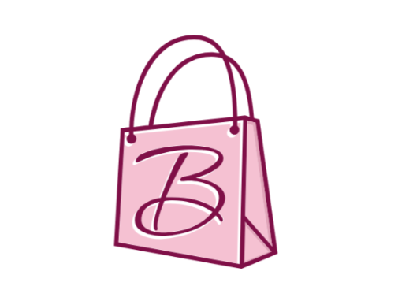

# BUZZCART - Modern E-commerce Platform

  

BUZZCART is a modern, responsive e-commerce platform built with React and Tailwind CSS. It provides a seamless shopping experience with a clean, intuitive interface and powerful features for both customers and administrators.

## ✨ Features

- 🛍️ **Complete Shopping Experience** - Browse products, view details, and manage your cart
- 📱 **Fully Responsive** - Perfect experience on desktop, tablet, and mobile devices
- 🎨 **Modern UI/UX** - Clean, intuitive design with smooth animations and transitions
- 🔍 **Product Discovery** - Advanced search and filtering capabilities
- 📦 **Product Categories** - Organized product listings with categories
- 🆕 **New Arrivals** - Dedicated section for latest products
- 📝 **Blog Integration** - Content marketing and product updates
- 👤 **User Authentication** - Secure signup, login, and profile management
- 🛒 **Shopping Cart** - Persistent cart with quantity management
- ❤️ **Wishlist** - Save favorite items for later
- ⚡ **Fast Performance** - Optimized for quick loading and smooth browsing

## 🚀 Quick Start

### Prerequisites

- Node.js (v14 or higher)
- npm or yarn package manager

